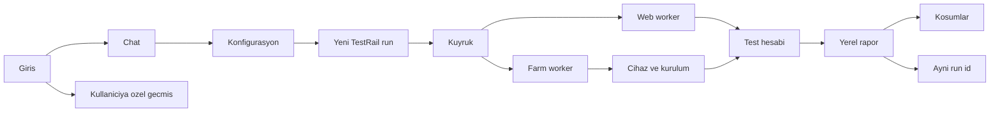

# Mercury Test Runner

Her şirket bu uygulamayı kendi makinesine kurar. Bir kurulum bir şirkettir. Veriler o makinenin diskindedir. Aynı ofisteki kişiler bu adresden chat’e yazar, koşum başlatır ve raporu açar.

Midscene forklanmaz. Ürün `@midscene/web`, `@midscene/android`, `@midscene/ios` ve `@midscene/test` paketlerini kullanır. Yeni Midscene sürümü paket versiyonu yükseltilerek alınır, sonra Mercury Test Runner’ın kendi sürümü olarak yayınlanır.

Cihaz laboratuvarı bu ürünün içinde değildir. Telefon ve tablet [Mercury Farm](https://github.com/erdncyz/mercury-farm) üzerindedir. Ürün farm’ı [automation API](https://github.com/erdncyz/mercury-farm/blob/main/docs/automation-api.md) ile kullanır.

## Şu an kodda olan

`0.1.0` çalışan bir ilk kurulumdur. Planın tamamı bu sürümde bitmiş değildir.

Kodda olanlar:

- `npm start` ve Docker Compose ile yerel açılış
- Yerleşik admin: `mercury@test.com` / `Mercury`. Bu hesap silinmez
- Kayıt, `pending` durum, admin onayı, `admin` ve `user` rolleri
- Ayar API’si yalnız admin’e açık. Model, TestRail ve farm sırları veritabanında şifreli durur
- Chat: `örnek proje web chrome koş`, `… demek` ile bellek, `ayar testrail host …` ile sınırlı ayar cümlesi
- Her koş komutu yeni bir yerel koşum açar. TestRail ayarı doluysa `add_run` denenir. Eski run’a yazılmaz
- Paralellik konfigürasyon başınadır (bir projede 1, diğerinde 4 hat). Genel tek sınır, bu sunucuda aynı anda açık tarayıcı sayısıdır (`web_concurrency`, varsayılan 2); Android/iOS için Mercury sınır koymaz, Farm'daki boş cihazlar ve UDID havuzu belirler. Boş Farm cihazı yoksa mobil koşum konfigürasyonun bekleme süresi (varsayılan 30 dk) boyunca 30 sn aralıkla yeniden dener, hesap veya case satırı tüketmez
- Proje bağımsız test hesap kaynakları (HTTP servis veya elle girilen liste) ve genel REST şablonları
- Koşumlar sayfası ve `reports/{id}/index.html`
- Android ve iOS koşumu Midscene ile gerçekten koşar; cihaz yalnız Mercury Farm'dadır. Worker cihazı ayırır, satırda APK/IPA adresi varsa Farm'a kurdurur, `useDevice` ile bağlantı adresini alır. Android: bu sunucunun ADB'si `adb connect` yapar, `@midscene/android` `AndroidAgent` o hedefi sürer. iOS: `@midscene/ios` `IOSAgent` Farm'ın WebDriverAgent adresine HTTP ile bağlanır; bu sunucuda Xcode gerekmez. Her case uygulamayı soğuk açar, sonuç Farm Builds sayfasına senaryo olarak yazılır ve cihaz `result=passed|failed` ile bırakılır
- Cihaz filtresi (`Pixel`, `Galaxy`, `iPhone 15`, seri…) ve chat'teki cihaz ipucu Farm'ın bookable listesinde üretici, model, pazar adı ve seriye göre eşleşir; seçilen cihaz `serials` ile ayrılır
- Web koşumu Midscene ile gerçekten koşar: Playwright Chromium açılır, YAML adımları (`launch`, `aiAct`, `aiInput`, `aiTap`, `aiAssert`, `aiWaitFor`, `aiQuery`, `sleep`) sırayla yürütülür. Her case için Midscene HTML raporu ve webm video `reports/{id}/` altına yazılır. İlk başarısız adımdan sonrakiler `Atlandı` olur
- Chat geçmişi kullanıcıya özeldir (`chat_messages`) ve ayrı `#/history` sayfasında `GET /api/chat/history?q=` ile aranır. Chat yalnızca aktif oturumu gösterir. Chat ve geçmişteki koşum kartlarında case ve YAML adımları görünür; adım durumu koşarken 3 sn’de bir güncellenir
- Sağ üstte, manifest adresi doluysa “Güncelleme var” okuması

Bu sürümde olmayanlar, aşağıdaki planın geri kalanıdır: Smart TV sürüşü, TestRail’den case çekip YAML üretmek, model ile serbest sohbet, koşum sırasında DB sorgusu, imaj çekip güncelleme.

Model bağlı değilse veya Midscene model ailesi belirlenemiyorsa web ve mobil koşum `blocked` kalır. Farm, ADB (Android) veya paket kimliği eksikse konfigürasyon ön kontrolü koşumu başlatmaz. Adımlar gerçekten koşmadan hiçbir koşum `passed` sayılmaz.

## Başlatma

Node 22 veya üzeri gerekir.

```bash
npm start
```

`npm start` önce `scripts/setup.mjs` çalıştırır: `package.json` içinde sabitlenmiş Midscene (web, Android, iOS) ve Playwright sürümleri `node_modules` ile uyuşmuyorsa `npm ci` ile kurar, o Playwright’ın beklediği Chromium yoksa indirir. ADB bulunamazsa (`MERCURY_ADB_PATH`, `ANDROID_HOME`, macOS Android SDK, `PATH`) Google Android platform-tools `tools/platform-tools/` altına indirilir ve `adb start-server` ile `~/.android/adbkey.pub` üretilir. İlk açılışta internet gerekir; sonraki açılışlar kontrolü birkaç yüz milisaniyede geçer. Elle çalıştırmak için `npm run setup`. Atlamak için `MERCURY_SKIP_SETUP=1`.

Adres: http://localhost:8080

Docker:

```bash
docker compose up --build
```

İmaj derlenirken `package-lock.json` ile paketler, `npx playwright install --with-deps chromium` ile tarayıcı ve Debian `adb` paketi kurulur. ADB anahtarı `/data/android` içinde kalır; imaj güncellense de Farm aynı anahtara güvenmeye devam eder.

Veritabanı `data/mercury.sqlite`, uygulama anahtarı `data/app.key`, raporlar `reports/`, Midscene’ın ham çıktıları `data/midscene_run/` altındadır. Docker’da bunlar `/data` volume’undadır. Güncelleme bu volume’u silmez.

Kontrol:

```bash
npm test          # birim ve API testleri (tarayıcısız, birkaç saniye)
npm run test:e2e  # gerçek Chromium + Midscene ile uçtan uca web testi (~1 dk)
```

`test:e2e` dış servis veya model anahtarı gerektirmez. `e2e/fakes.mjs` yerel olarak çerez bandı olan bir giriş sitesi, token ile giriş yapılan bir test kullanıcı servisi, sahte TestRail ve OpenAI uyumlu bir görsel model açar. Model sonucu uydurmaz: Midscene'in gönderdiği ekran görüntüsünü çözüp sayfanın gerçek durumuna göre öğe koordinatı ve doğrulama yanıtı verir; yani adımlar gerçek tarayıcıda gerçekten tıklanıp yazıldığı için geçer ya da düşer. Yürütücü (`e2e/run.mjs`) ayrı bir veri klasörüyle Mercury'yi başlatır ve bir admin gibi API'den model, TestRail, hesap kaynağı ve konfigürasyonu kurar, koşumu chat'ten başlatır; ardından case/adım durumlarını, 2 paralel hattı ve ayrı kilitli kullanıcıları, TestRail sonuçlarını, rapor/video dosyalarını, video `Range` desteğini, chat geçmişini, hiçbir yanıtta ve raporda şifre kalmadığını, kullanıcı tükenmesini ve arızaları (TestRail kapalı, uygulama kapalı, yanlış model anahtarı) doğrular. `--keep` ile Mercury açık kalır ve sonuç arayüzde incelenebilir. Case'ler `e2e/cases/` altındadır (`CASES_DIR` ile verilir).

## Midscene

- Sürüm: `@midscene/web`, `@midscene/android`, `@midscene/ios` ve `playwright` `package.json` içinde tam sürümle sabitlenir (şu an Midscene 1.13.3, Playwright 1.63.0). Arayüzde sol altta ve `GET /api/version` içinde görünür.
- Model: Ayarlar → Model’deki kayıt her koşumda Midscene’a ajan başına `modelConfig` olarak verilir (`MIDSCENE_MODEL_NAME`, `_BASE_URL`, `_API_KEY`, `_FAMILY`). Ortam değişkeni değiştirilmez, eşzamanlı koşumlar birbirini etkilemez.
- Model ailesi: Midscene ekranda öğe bulmak için `MIDSCENE_MODEL_FAMILY` ister. Model adından otomatik algılanır (Qwen3-VL, Gemini, GPT-5/6, Doubao Seed, UI-TARS, GLM-V, DeepSeek, Kimi…). Algılanamazsa Ayarlar → Model’den seçilir; seçilmezse koşum `blocked` olur. Amazon Bedrock IAM, OpenAI uyumlu olmadığı için Midscene ile kullanılamaz.
- Adım değişkenleri: `{{launchUrl}}`, `{{account.email}}`, `{{account.password}}`, `{{account.phone}}`. Çözülemeyen değişken o adımı açık bir hatayla düşürür. Şifre için `aiInput` kullanılır: alanı model bulur, değer doğrudan yazılır, şifre modele talimat olarak gitmez ve arayüzde gösterilmez. Midscene’ın yerel HTML raporu yazılan değeri içerebilir; raporlar yalnız oturum açmış kullanıcılara sunulur.
- Mobil adımlar: web ile aynı YAML çalışır. `launch` mobilde `{{launchUrl}}` değerini (konfigürasyondaki açılış adresi, yoksa paket kimliği) `agent.launch` ile açar. Ek olarak `back` ve `home` adımları desteklenir.
- ADB anahtarı: Ayarlar → Mercury Farm → “Bağlantıyı dene” Farm erişimini doğrular ve bu sunucunun `adbkey.pub` anahtarını `POST /api/v1/user/adbPublicKeys` ile Farm'a kaydeder. Android cihazlar kayıtsız anahtarı reddeder.
- Tarayıcıyı görmek için `MERCURY_HEADLESS=0 npm start`.
- Şifre güvenliği: Midscene'in case raporu `aiInput` ile yazılan değeri içerir. Mercury raporu `reports/{id}/` altına kopyalarken test kullanıcısının şifresini (düz, JSON ve HTML kaçışlı biçimleriyle) `••••••••` ile maskeler ve `MIDSCENE_RUN_DIR` içindeki maskesiz orijinali siler. Midscene'in dosya günlükleri de yazılan değerleri tuttuğu ve döndürülmediği için varsayılan olarak kapalıdır; sorun giderirken `MERCURY_MIDSCENE_LOGS=1 npm start` ile açılır (günlükler şifre içerebilir).
- `CASES_DIR`: case klasörü (varsayılan `cases/`).

## Midscene güncelleme

Midscene forklanmaz. Yeni Midscene sürümü Mercury Test Runner’ın yeni sürümüyle gelir:

1. Geliştirici `npm run midscene:upgrade` çalıştırır. Bu, `@midscene/web`, `@midscene/android`, `@midscene/ios` ve `playwright` paketlerini en son sürüme tam sürümle yükseltir, `package-lock.json`’ı yeniler ve Chromium’u kurar.
2. `npm test` ve bir web koşumuyla doğrulanır, `version.json` artırılır, sürüm yayınlanır.
3. Kurulumlar projeyi güncellediğinde (yeni kod + `npm start`, ya da yeni Docker imajı) `setup` sürüm farkını görür ve Midscene’ı (web, Android, iOS), Playwright’ı, Chromium’u ve ADB’yi kendiliğinden hazırlar. Elle adım yoktur.

## Kullanıcının gördüğü akış



Onaylı kullanıcı kurulumun adresinden girer. Sağ üstte yeni sürüm varsa “Güncelleme var” görür. Güncellemeyi yalnız admin başlatır. User chat ve Koşumlar sayfasını görür. Ayarlar, üye onayı, hesap kaynağı ve cihaz satırları yalnız admin’dedir.

Chat bir agent’tır. “örnek proje web chrome koş”, “örnek proje regresyonunu başlat” veya “iPhone 15’te android koş” gibi cümleleri, admin’in kaydettiği client, konfigürasyon, cihaz filtresi ve case listesine bakarak çözer. Bunu Midscene ile aynı model anahtarıyla yapar. Ayrı bir sohbet anahtarı yoktur. Satır platformu, cihaz filtresini, kurulacak paketi ve test hesap kaynağını bilir. Kullanıcı seri numarası seçmez. Cümlede cihaz geçerse filtre o koşum için daralır. Agent eski bir TestRail run’ına sonuç basamaz. Admin aynı sohbetten ayar da yazar. User rolü ayar cümlesinde reddedilir.

Her komut önce konfigürasyon ön kontrolünden geçer. Case kapsamı, başlangıç URL'si, seçili hesap kaynağı, hesap politikası, model/farm bağlantısı ve platform yürütücüsü hazırsa yeni TestRail run açılır. Ön kontrol geçmezse dış sistemde run açılmaz; yerel koşum `blocked` kalır ve eksikler kullanıcıya yazılır. İkinci kullanıcı aynı anda başka bir komut yazarsa ayrı koşum açılır. Tarayıcı, cihaz ve test hesabı koşumlar arasında paylaşılmaz.

Web satırı bu makinede Chrome açar; Android ve iOS satırı Farm'dan cihaz ayırıp Midscene ile sürer. Konfigürasyon, test hesabının hangi kaynaktan ve `zorunlu`, `opsiyonel` veya `kapalı` politikasıyla alınacağını belirler. Worker hesabı koşum başlarken alır; `{{account.email}}`, `{{account.password}}` ve `{{account.phone}}` değişkenlerini yalnız yürütücüye verir. Şifre UI, API koşum yanıtı veya rapora yazılmaz.

Bittiğinde HTML oynatma ve varsa webm `reports/{runId}/` altında kalır. Koşumlar sayfası run id, cihaz, hesap e-postası ve raporu gösterir. Şifre görünmez. TestRail sonucu yalnız bu yeni run id’ye yazılır. Cihaz bırakılır. Test hesabı kullanıldı olarak işaretlenir.

## Giriş ve roller

İki rol vardır: `admin` ve `user`. Onaysız hesap içeri girmez.

- Kurulumla birlikte admin hazır gelir: `mercury@test.com`, şifre `Mercury`.
- Sonraki kayıtlar `pending` kalır. O kurulumun bir admin’i onaylamadan oturum açamazlar.
- Admin bekleyen kullanıcıyı onaylar ve rolünü `admin` veya `user` yapar. Reddedilen hesap giriş yapamaz.
- `user` chat, koşum listesi ve raporları görür. Ayarlar menüsü ona çizilmez.
- Ayar API’si de rol kontrolü yapar. Arayüzü gizlemek yetmez. `user` oturumu ile model, TestRail, farm ve uygulama adresi okunamaz ve yazılamaz.

## Ayarlar

Ayar ekranı yalnız `admin` rolüne açıktır. Anahtarlar o kurulumun veritabanında durur. Sır alanlar `data/app.key` ile AES-256-GCM ile şifrelenir. Ekranda geriye yalnız maske döner.

- Üyeler: admin, bekleyen kayıtları ve rolleri buradan yönetir.
- Model: `model_api_key`, `model_name`, `model_base_url`, `model_family`. Midscene ekranı ve chat agent’ı aynı kaydı kullanır.
- TestRail: host, e-posta, API key, project id. Bağlantı denemesi `GET /api/v2/get_projects`.
- Farm: Mercury base URL ve bearer token. Doğrulama `GET /api/v1/user`.
- Uygulama paketleri: platform, ad, HTTPS üzerindeki `.apk` veya `.ipa` adresi, Android `applicationId` veya iOS bundle id. Bu bir disk yolu değildir.
- Test hesap kaynakları: her proje kendi kaynağını tanımlar (aşağıda “Test hesapları”). Ürün girişi `mercury@test.com` ile karışmaz. Bunlar koşulan uygulamanın test kullanıcılarıdır.
- `web_concurrency`: bu sunucuda aynı anda açık en fazla tarayıcı (tüm projeler ve kullanıcılar toplamı). Varsayılan `2`. Proje paralelliği bu değil; o konfigürasyondadır.
- `public_base_url`: TestRail yorumuna yazılacak rapor adresinin kökü. Mercury yalnız aynı bilgisayarda kullanılacaksa boş bırakılabilir.
- `update_manifest_url`: isteğe bağlı yeni sürüm JSON adresi. Kurumsal bir güncelleme sunucusu yoksa boş bırakılır; test koşumlarını etkilemez.

Chat’ten ayar biçimi, admin için:

```text
ayar testrail host https://sirket.testrail.io
ayar testrail key ...
ayar farm url https://farm.sirket
ayar model key ...
```

Anahtarın tamamı sohbete ve belleğe yazılmaz.

## TestRail modeli

Yapı üç katmandır.

- Proje: TestRail projesi (Ayarlar → TestRail → proje numarası).
- Client: bir Test Suite. Her ürün veya uygulama bir client'tır; suite numarası client'ta durur.
- Konfigürasyon: aynı client’ın ayrı koşu hedefi. Örnekler: Web (Chrome), Android (Güncel sürüm), Android (Yeni sürüm), iOS (Güncel sürüm), iOS (Yeni sürüm), Smart TV.
- Konfigürasyon plan alanları: ortam, chat takma adları, platform, başlangıç URL'si veya cihaz/paket hedefi, paralel koşum sayısı (1–20), cihaz UDID listesi, hesap kaynağı, politikası ve kullanıcı filtreleri, açık case ID'leri veya case etiketleri, regresyon üyeliği ve aktiflik.
- Paralel koşum: bir koşum `paralel` sayıda hatta bölünür (UDID havuzu ve case sayısıyla sınırlı). Case'ler hatlara sırayla dağıtılır (5 case, 2 hat → 3 + 2). Her hat kendi tarayıcısında veya kendi Farm cihazında, kendi test kullanıcısıyla, aynı anda Midscene koşar. Mobilde tüm hatların cihazları tek Farm grubunda ayrılır, sonuçlar tek Builds kaydında toplanır, cihazlar birlikte bırakılır. UDID girilirse yalnız o cihazlar kullanılır ve paralel sayısı kadar UDID gerekir; fazlası yedek havuzdur. Test kullanıcısı alındığı anda kilitlenir; iki hat veya iki koşum aynı hesabı almaz. Web hatları sunucunun tarayıcı sınırına (`web_concurrency`) sayılır; tek başına sınırdan geniş bir koşum, başka web koşumu yokken başlar. Mobil konfigürasyonda ayrıca boş cihaz bekleme süresi (1–1440 dk) ayarlanır. Case ID kapsamı etiket kapsamından önceliklidir; ikisi de boşsa client'ın tüm YAML case'leri seçilir.
- Section ve case: TestRail'deki bölüm ve case'ler (örn. Giriş, Arama, Sepet, Profil). Case kimliği C1201 gibidir; YAML'da `testrailCaseId: 1201` yazılır.

Platform eşlemesi:

- Web (Chrome) bu makinedeki Playwright worker
- Android telefon, tablet ve Android TV için Mercury Farm `type=android`
- iPhone, iPad ve Apple TV için Mercury Farm `type=ios`
- Smart TV satırı kayıtlı kalır. Yürütücü olmadığı için koşum başlamaz ve chat bunu söyler

Current Version ile New Version iki ayrı satırdır. İkisi iki ayrı paket kurar.

Yeni kurulumda nötr bir **Örnek Proje** gelir: Web (Chrome) (`https://example.com`), Android ve iOS satırları. Örnek case `cases/ornek-proje/ornek/ornek-sayfa.yaml` example.com'u açar ve sayfayı Midscene ile doğrular; model bağlanınca gerçekten koşar. Örnek proje yalnız hiç client yokken bir kez eklenir; silinirse geri gelmez.

## Koş komutu yeni run açar

“Koş” denince açık duran run’a, örneğin R2131’e, sonuç yazılmaz. Her komut yeni bir TestRail kaydı açar.

Tek konfigürasyon, “örnek proje web chrome koş”:

1. İfade proje, client’ın suite’i ve konfigürasyon Web (Chrome) olarak çözülür.
2. `POST /index.php?/api/v2/add_run/{project_id}` ile yeni run açılır. `suite_id` client suite’idir. Ad `Örnek Proje (Web (Chrome))` ve tarihtir. `include_all` false kalır. `case_ids` yalnız bu konfigürasyon için YAML’ı olan case’lerdir.
3. Dönen `id` koşumun TestRail run id’sidir. Ürün içi kayıt da bu id’yi saklar.
4. Worker case’leri koşar. Bitince `POST /index.php?/api/v2/add_results_for_cases/{run_id}` yalnız bu id’ye yazar. Yorumda rapor linki vardır.
5. YAML’ı olmayan case yeni run’a seçilmez. Automation sütunu None olan case’ler bu run’a kopyalanmaz.

Birden fazla konfigürasyon, “örnek proje regresyon koş”:

1. `POST /index.php?/api/v2/add_plan/{project_id}` ile yeni plan açılır.
2. Admin’in bu client için regresyona aldığı her konfigürasyon bir entry olur. TestRail her entry için ayrı run id üretir.
3. Her run kendi worker’ında koşar. Sonuç kendi run id’sine yazılır.
4. Eski planlar ve duran run’lar değiştirilmez.

Case dönüşümü bir kez üretilir ve gözden geçirilir. Dosya `cases/<client>/<bölüm>/<case>.yaml` biçimindedir (örnek: `cases/ornek-proje/ornek/ornek-sayfa.yaml`). Step `aiAct`, expected `aiAssert` olur. Aynı YAML, o case’in seçildiği her konfigürasyonda kullanılır. Kurulan uygulama ve açılış adresi konfigürasyondan gelir.

TestRail durumları projeye göre değişir. Varsayılan eşleme: passed `1`, blocked `2`, failed `5`. Alanlar `get_statuses` ile doğrulanır.

## Hangi cihazda koşulacağı

Kullanıcı seri numarası seçmez. Cihazı chat’teki konfigürasyon belirler. “örnek proje ios koş”, admin’in “iOS” satırına gider.

Admin her satıra şunları bağlar. Satırlar elle eklenir ve değiştirilir.

- Platform: `web`, `android`, `ios` veya `tv`
- Farm tipi: `android` veya `ios`
- Cihaz filtresi: boşsa o tipte boş olan ilk cihaz. Doluysa model, ad veya seri. filtresi `Pixel` olan bir Android satırı yalnız Pixel cihazlarda koşar
- Uygulama: APK/IPA HTTPS adresi, paket kimliği, açılış adresi
- Web satırında farm ve paket yoktur. Tarayıcı Chrome ve açılış adresi vardır

“örnek proje ios, iPhone 15 koş” o koşum için filtreyi daraltır. Eşleşen boş cihaz yoksa koşum sırada bekler. Başlayınca Koşumlar sayfasında cihazın adı ve serisi görünür.

Kurulum sırası:

1. Filtre boşsa `GET /api/v1/autotests?run=...&type=android|ios&amount=1` ile boş cihaz ayrılır. Filtre doluysa `GET /api/v1/devices?target=bookable` listesinde eşleşen boş cihaz bulunur ve `serials` ile ayrılır (Farm'ın `model` filtresi tam eşleşmedir). `409` gelirse koşum sırada bekler.
2. `POST /api/v1/autotests/install/{serial}` ile satırdaki URL kurulur. Ürün ADB veya Xcode çalıştırmaz.
3. `POST /api/v1/autotests/useDevice` ile `remoteConnectUrl` alınır.
4. Android: worker `adb connect` yapar. Midscene `AndroidDevice` bu uzak ADB’ye bağlanır ve `launch(applicationId)` uygulamayı açar. Worker’ın ADB public key’i farm’da Settings, Keys, ADB Keys altında kayıtlı olmalıdır.
5. iOS: `remoteConnectUrl` WebDriverAgent adresidir. Midscene `IOSDevice` oraya bağlanır ve bundle id ile uygulamayı açar. WDA imzası farm Mac’inde bir kez yapılır. IPA, o cihazların provisioning profiline dahil olmalıdır.
6. Case sonuçları `PUT /api/v1/builds/{group}/scenarios` ile Farm Builds sayfasına yazılır.
7. Koşum bitince, hata olsa bile, `adb disconnect` yapılır ve `DELETE /api/v1/autotests?group=...&result=passed|failed` cihazı bırakır.

## Aynı anda birden fazla koşum

İki kullanıcı aynı anda farklı komut yazabilir. Her komut kendi TestRail run id’sini açar.

- Web: aynı makinede birden fazla Playwright oturumu. Açık tarayıcı toplamı `web_concurrency`'yi aşamaz. Sınır dolunca yeni web koşumu sırada bekler, reddedilmez.
- Telefon: her mobil koşum farm’dan kendi cihazını ayırır. Aynı seri iki koşuma verilmez. Sınır Farm'daki boş cihazlar ve konfigürasyonun UDID havuzudur. Boş cihaz yoksa koşum konfigürasyonun bekleme süresi boyunca sırada kalır.
- Test hesabı: çekilen hesap o koşuma kilitlenir. İkinci koşum aynı e-postayı almaz. Koşum bitince hesap kullanıldı işaretlenir.
- Rapor ve TestRail sonucu ayrıdır. Koşumlar sayfasında ikisi birden, kimin başlattığıyla görünür.

Aynı client ve aynı konfigürasyon da iki kez başlayabilir. İkisi iki ayrı run olur.

## Test hesapları

Mercury yalnız bir firmaya veya bir projeye bağlı değildir; test kullanıcılarının nereden geleceğini her kurulum kendisi tanımlar. Ayarlar → **Test hesap kaynakları** bölümünde kaynak eklenir, kopyalanır, düzenlenir, denenir ve (kullanan konfigürasyon yoksa) silinir. Konfigürasyon bir kaynak ve kullanım biçimi (zorunlu / opsiyonel / kapalı) seçer.

Kapsam: kaynak bir client'a bağlanabilir ya da **tüm client'lara ortak** olabilir. Kullanan başka client varken kapsam daraltılamaz.

İki kaynak türü vardır:

**HTTP servis** — kullanıcıları herhangi bir API'den alır. Kodda sabit adres veya alan yoktur; hepsi kaynaktadır:

- Servis adresi ve kimlik doğrulama: yok, giriş isteği → token (yol, gövde, yanıttaki token alanı, başlık adı ve öneki, örn. `Authorization: Bearer …`), sabit API anahtarı başlığı veya Basic auth. Servis kullanıcı adı, şifre ve API anahtarı **kaynağa özeldir**, AES-256-GCM ile şifreli saklanır, geri gösterilmez. Gövdede `{{username}}`, `{{password}}` kullanılır.
- Hesap listesi isteği: metod, yol, filtre parametreleri (GET'te sorgu, diğerlerinde gövde) ve yanıtta liste alanı (örn. `data.items`). `environment` konfigürasyonun ortamıyla değişir. `is…` ile başlamayan diğer parametreler her konfigürasyonda ayrıca filtrelenebilir (paket, ülke, kullanıcı tipi…).
- Alan eşlemesi: kullanıcı adı/e-posta, şifre, telefon, kimlik; nokta ile iç alanlara inilir. **Ek alanlar** (`pin=profile.pin`) YAML'da `{{account.pin}}` olur.
- Kullanıldı işareti (opsiyonel): hesap alındığı anda gönderilir (`{{id}}`, `{{email}}`); böylece başka koşum aynı kullanıcıyı almaz.
- “Bağlantıyı dene” kaydetmeden bir hesap okur, alanları gösterir, şifreyi göstermez ve hesabı kilitlemez.

**Elle girilen liste** — API'si olmayan projeler için. Her satır `kullanıcı, şifre, telefon` (virgül, noktalı virgül veya Excel'den sekme). Şifreler şifreli saklanır. “Tekrar kullanılabilir” modda hesap koşum boyunca kilitlenir, sonra havuza döner (en uzun süredir kullanılmayan önce verilir). “Tek kullanımlık” modda bir kez verilen hesap bir daha verilmez; “Kullanılanları sıfırla” ile geri açılır.

Her iki türde de paralel hatlar ve eşzamanlı koşumlar aynı kullanıcıyı almaz. Kaynak hazır değilse (adres, giriş bilgisi, API anahtarı eksik, listede hesap yok…) konfigürasyon ön kontrolü bunu kaynağın adıyla yazar; zorunlu kullanımda koşum başlamaz.

Yeni kaynak açarken “Şablondan başlat” listesinde genel REST şablonları durur: token ile giriş, API anahtarı, Basic auth ve kimlik doğrulamasız servis. Şablonlarda adres yoktur; yollar ve alanlar servise göre değiştirilir. Kurulumla hazır kaynak gelmez. Eski sürümlerdeki tek, genel servis girişi (Ayarlar → Test hesap servisi) ilk açılışta HTTP kaynaklarına taşınır ve genel ayardan silinir.

Rapor hangi hesap e-postasının kullanıldığını yazar. Şifreyi basmaz.

## Chat agent ve bellek

Agent’ın araçları sabittir: konfigürasyonları listele, yeni TestRail run veya plan aç, koşumu kuyruğa koy, durumu söyle, belleğe yaz, admin ise ayar kaydet. Listede olmayan client veya cihaz uydurulmaz.

Bellek kurulumun veritabanındadır. Güncellemede silinmez. Agent her cümleden önce bu kayıtları okur.

- Düzeltme: “gece regresyonu örnek proje web chrome demek”
- Çalışma biçimi: “üyelik case’lerinde önce çerez bandını kapat”
- Ayar özeti: hangi client’a hangi kaynak bağlandı. Sır değer bellekte düz metin durmaz

User düzeltme yazdırabilir. Ayar cümlesi user’da çalışmaz.

Bu sürümde serbest model çağrısı yoktur. Eşleşme kayıtlı takma ad, bellek cümlesi ve `ayar ...` kalıbıdır. Model anahtarı Midscene koşumu için saklanır. Agent’ın aynı anahtarla serbest cümle çözmesi planın sonraki dilimidir.

## Veriler nerede durur

Hepsi kurulan makinededir. Ayrı bir buluta kopyalanmaz.

- Kullanıcılar: e-posta, rol, durum (`pending`, `active`, `rejected`), şifre özeti. Şifre düz metin yazılmaz ve ekranda geri gösterilmez.
- Koşum: plan id, TestRail run id, client, konfigürasyon, durum, süre, cihaz, hesap e-postası, başlatan kullanıcı.
- Bellek: düzeltme ve ayar özeti.
- Denetim kaydı: kim ayar değiştirdi, kim koşum açtı.
- Rapor: `reports/{runId}/`. Midscene HTML’i ve adım görüntüleri, üretildiyse `startObserving` kareleri, web koşumunda Playwright webm dosyası. Android ve iOS için ayrı mp4 tutulmaz. Farm’daki canlı yayın koşum bitince kaybolur. Saklanan kayıt Midscene HTML oynatmasıdır.

Koşumlar sayfası bu dosyaları aynı siteden sunar. TestRail’e giden yalnız yeni run’ın sonucu ve bu sitedeki rapor linkidir.

## Arayüz

Ad arayüzde Mercury Test Runner’dır. Açık temalı, sade kurumsal bir SaaS arayüzüdür (Minimalism / Swiss stili).

- Zemin `#FFFFFF`, sayfa zemini `#FAFAFA`, kenar `#E4E4E7`, metin `#09090B`, ikincil metin `#71717A`, birincil düğme `#18181B`, odak halkası `#2563EB`
- Renk yalnız durum için kullanılır: geçti yeşil, başarısız kırmızı, engellendi amber, koşuyor mavi (açık zeminli rozetler)
- Yazı Inter, run id ve log JetBrains Mono
- Emoji ikon yok, SVG ikon kullanılır. Odak halkası, `prefers-reduced-motion` ve klavye ile gezinme vardır

Ekranlar: ortalanmış giriş/kayıt (sekmeli). Üstte logo, sekmeli ana menü, model durumu ve kullanıcı menüsü (sürüm, çıkış). Adres sayfayla eşleşir (`#/chat`, `#/history`, `#/runs`, `#/configs`, `#/settings`, `#/people`).

- Chat: ortalanmış aktif sohbet. Açılışta “Ne koşalım?” başlangıç ekranı ve komut kartları. Koşum kartında case, adım zaman çizelgesi, ilerleme çubuğu ve başarısız adımın hatası
- Geçmiş: yalnızca giriş yapan kullanıcıya ait konuşmaları en yeniden eskiye kartlar halinde gösterir; mesaj ve yanıtlarda arama yapılabilir
- Koşumlar: özet sayılar, durum filtresi ve tablo. Satıra tıklayınca sağdan açılan panelde adımlar canlı güncellenir
- Konfigürasyonlar: client’a göre gruplu yürütme planı; case sayısı, paralel hat, UDID/filtre, ortam, test kullanıcısı, eksik bağımlılıklar ve “Chat'e al”. Admin **Yeni konfigürasyon** ile satır (gerekirse yeni client ve TestRail suite) ekler, **Kopyala** ile bir satırdan yenisini açar, **Düzenle** ile değiştirir. Pencere bölümleri: Temel (client, platform, ad, ortam, chat takma adları), Uygulama (web URL’si veya paket kimliği + APK/IPA), Cihazlar ve paralel koşum (paralel sayısı, UDID listesi, filtre), Test kullanıcısı (kaynak, kullanım, kaynağa özel filtreler: paket, ülke, kullanıcı tipi) ve Case kapsamı. Üstteki canlı özet case sayısını, hat sayısını, hat başına case’i ve cihaz/kullanıcı ihtiyacını gösterir. Aynı client’ta iki satır aynı ad veya chat takma adını kullanamaz; kopyada takma adlar boş gelir
- Ayarlar (admin): solda bölüm listesi, sağda Model, TestRail, Mercury Farm, Test hesap kaynakları (liste + ekle/kopyala/düzenle/dene/sil penceresi) ve Genel kartları
- Üyeler (admin): menüde bekleyen sayısı, tabloda rol seçerek onay veya red

860px altında tablolar ikincil sütunları gizler, ayarlar tek sütuna iner.

## Güncelleme

Sürüm `version.json` içindedir. Manifest JSON’u `version` ve `notes` taşır. Uygulama bu adresi okur. Yeni sürüm varsa sağ üstte “Güncelleme var” görünür. Rozeti admin ve user görür.

Güncellemeyi yalnız admin başlatır. Onaydan sonra updater yeni imajı çeker, konteynerler yeniden başlar, veritabanı ve raporlar volume’da kalır. Çekme başarısız olursa eski imaj çalışmaya devam eder. User bu çağrıyı yapamaz.

Bu sürüm rozeti okur. İmajı çekip yeniden başlatma sonraki dilimdedir.

## Dizin

Şu anki kod tek süreçtir. Planlanan ayrım şöyledir:

- `public/` arayüz
- `src/server.mjs` HTTP, oturum, chat, ayarlar
- `src/worker.mjs` kuyruk, eşzamanlılık, case YAML okuyucu
- `src/midscene.mjs` model → Midscene `modelConfig`, aile algılama, Playwright + Midscene ile adım yürütme
- `scripts/setup.mjs` sabit sürümlü paketleri ve Chromium’u kurar/eşitler
- `src/integrations.mjs` TestRail ve farm HTTP istemcisi
- `src/accounts.mjs` hesap kaynakları: genel HTTP servis istemcisi, elle girilen liste, kilitleme
- `src/agent.mjs` cümle çözümü ve bellek kalıbı
- `cases/` gözden geçirilmiş YAML
- `data/` veritabanı ve şifreleme anahtarı
- `reports/` HTML ve videolar

Planlanan paket ayrımı: `apps/web`, `apps/api`, `apps/worker`, `packages/testrail`, `packages/farm`.

## Bilinçli sınır

Cihaz laboratuvarı bu ürünün içinde kurulmaz. Müşteri kendi Mercury Farm adresini ayara yazar. iOS imzalama, farm dokümanındaki tek seferlik WebDriverAgent adımıdır.
