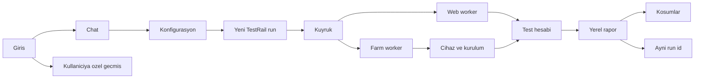

# Mercury Test Runner

Her şirket bu uygulamayı kendi makinesine kurar. Bir kurulum bir şirkettir. Veriler o makinenin diskindedir. Aynı ofisteki kişiler bu adresden chat’e yazar, koşum başlatır ve raporu açar.

Midscene forklanmaz. Ürün `@midscene/web`, `@midscene/android`, `@midscene/ios` ve `@midscene/test` paketlerini kullanır. Yeni Midscene sürümü paket versiyonu yükseltilerek alınır, sonra Mercury Test Runner’ın kendi sürümü olarak yayınlanır.

Cihaz laboratuvarı bu ürünün içinde değildir. Telefon ve tablet [Mercury Farm](https://github.com/erdncyz/mercury-farm) üzerindedir. Ürün farm’ı [automation API](https://github.com/erdncyz/mercury-farm/blob/main/docs/automation-api.md) ile kullanır.

## Şu an kodda olan

`0.1.0` çalışan bir ilk kurulumdur. Planın tamamı bu sürümde bitmiş değildir.

Kodda olanlar:

- `npm start` ve Docker Compose ile yerel açılış
- Yerleşik admin: `mercury@test.com` / `Mercury`. Bu hesap silinmez
- Kayıt, `pending` durum, admin onayı, `admin` ve `user` rolleri
- Ayar API’si yalnız admin’e açık. Model, TestRail, Jira/Confluence ve farm sırları veritabanında şifreli durur
- Chat: `örnek proje web chrome koş`, `… demek` ile bellek, `ayar testrail host …` ile sınırlı ayar cümlesi
- Her koş komutu yeni bir yerel koşum açar. TestRail ayarı doluysa `add_run` denenir. Eski run’a yazılmaz
- Paralellik konfigürasyon başınadır (bir projede 1, diğerinde 4 hat). Genel tek sınır, bu sunucuda aynı anda açık tarayıcı hattı sayısıdır (`web_concurrency`; boşsa makinenin RAM ve işlemcisine göre otomatik, 16 GB/10 çekirdekte 12). Boşalan hatlar bekleyen kullanıcılar arasında adil paylaştırılır; Android/iOS için Mercury sınır koymaz, Farm'daki boş cihazlar ve UDID havuzu belirler. Boş Farm cihazı yoksa mobil koşum konfigürasyonun bekleme süresi (varsayılan 30 dk) boyunca 30 sn aralıkla yeniden dener, hesap veya case satırı tüketmez
- Proje bağımsız test hesap kaynakları (HTTP servis veya elle girilen liste) ve genel REST şablonları
- Koşumlar sayfası ve `reports/{id}/index.html`
- Android ve iOS koşumu Midscene ile gerçekten koşar; cihaz yalnız Mercury Farm'dadır. Worker cihazı ayırır, satırda APK/IPA adresi varsa Farm'a kurdurur, `useDevice` ile bağlantı adresini alır. Android: bu sunucunun ADB'si `adb connect` yapar, `@midscene/android` `AndroidAgent` o hedefi sürer. iOS: `@midscene/ios` `IOSAgent` Farm'ın WebDriverAgent adresine HTTP ile bağlanır; bu sunucuda Xcode gerekmez. Her case uygulamayı soğuk açar; Android ekranı case başında ve her adımdan önce `KEYCODE_WAKEUP` + `wm dismiss-keyguard` ile uyandırılır, AI'ya da siyah ekranın uyku olduğu ve bir kez dokunması gerektiği söylenir (iOS'ta yalnız bu ipucu vardır), sonuç Farm Builds sayfasına senaryo olarak yazılır ve cihaz `result=passed|failed` ile bırakılır
- Cihaz filtresi (`Pixel`, `Galaxy`, `iPhone 15`, seri…) ve chat'teki cihaz ipucu Farm'ın bookable listesinde üretici, model, pazar adı ve seriye göre eşleşir; seçilen cihaz `serials` ile ayrılır
- Web koşumu Midscene ile gerçekten koşar: Playwright Chromium açılır, YAML adımları (`launch`, `aiAct`, `aiInput`, `aiTap`, `aiAssert`, `aiWaitFor`, `aiQuery`, `sleep`) sırayla yürütülür. Her case için Midscene HTML raporu, webm video ve her adımdan sonra alınan ekran görüntüsü `reports/{id}/` altına yazılır. İlk başarısız adımdan sonrakiler `Atlandı` olur
- Chat geçmişi kullanıcıya özeldir (`chat_messages`) ve ayrı `#/history` sayfasında `GET /api/chat/history?q=` ile aranır. Chat yalnızca aktif oturumu gösterir. Chat ve geçmişteki koşum kartlarında case ve YAML adımları görünür; adım durumu koşarken 3 sn’de bir güncellenir
- Sağ üstte, manifest adresi doluysa “Güncelleme var” okuması
- Jira & Confluence (yalnız okuma): Ayarlar → Jira & Confluence'a Jira adresi ve e-posta + API token (Cloud) ya da PAT (Server/Data Center, e-posta boş) girilir; Confluence alanları boşsa Jira'nın bilgileri, Cloud'da `<jira>/wiki` kullanılır. Chat'te `PROJ-123 için test case çıkar ve koş`, bir `…/browse/PROJ-123` ya da Confluence sayfa bağlantısı yazılınca kayıt (açıklama, kabul kriteri alanları, son yorumlar, alt görevler, bağlı kayıtlar ve bağlı Confluence sayfaları) okunur ve QA ajanına verilir; ajan kabul kriterlerinden case'leri tasarlar, case başlıkları kayıt anahtarıyla başlar ve senaryo her zamanki gibi (TestRail'e yazılarak) koşar. `bu task için …` önceki mesajdaki kaydı kullanır. Okunamayan kayıt (yetki, 404, eksik ayar) açıkça söylenir. Case tasarımı için model bağlı olmalıdır. Chat ayar cümleleri: `ayar jira host|user|token …`, `ayar confluence host|user|token …`

Bu sürümde olmayanlar, aşağıdaki planın geri kalanıdır: Smart TV sürüşü, TestRail’den case çekip YAML üretmek, koşum sırasında DB sorgusu, imaj çekip güncelleme.

Model bağlı değilse veya Midscene model ailesi belirlenemiyorsa web ve mobil koşum `blocked` kalır. Farm, ADB (Android) veya paket kimliği eksikse konfigürasyon ön kontrolü koşumu başlatmaz. Adımlar gerçekten koşmadan hiçbir koşum `passed` sayılmaz.

## Başlatma

Node 22 veya üzeri gerekir.

```bash
npm start
```

`npm start` önce `scripts/setup.mjs` çalıştırır: `package.json` içinde sabitlenmiş Midscene (web, Android, iOS) ve Playwright sürümleri `node_modules` ile uyuşmuyorsa `npm ci` ile kurar, o Playwright’ın beklediği Chromium yoksa indirir. ADB bulunamazsa (`MERCURY_ADB_PATH`, `ANDROID_HOME`, macOS Android SDK, `PATH`) Google Android platform-tools `tools/platform-tools/` altına indirilir ve `adb start-server` ile `~/.android/adbkey.pub` üretilir. İlk açılışta internet gerekir; sonraki açılışlar kontrolü birkaç yüz milisaniyede geçer. Elle çalıştırmak için `npm run setup`. Atlamak için `MERCURY_SKIP_SETUP=1`.

Adres: http://localhost:8080

Docker:

```bash
docker compose up --build
```

İmaj derlenirken `package-lock.json` ile paketler, `npx playwright install --with-deps chromium` ile tarayıcı ve Debian `adb` paketi kurulur. ADB anahtarı `/data/android` içinde kalır; imaj güncellense de Farm aynı anahtara güvenmeye devam eder.

Veritabanı `data/mercury.sqlite`, uygulama anahtarı `data/app.key`, raporlar `reports/`, Midscene’ın ham çıktıları `data/midscene_run/` altındadır. Docker’da bunlar `/data` volume’undadır. Güncelleme bu volume’u silmez.

Kontrol:

```bash
npm test          # birim ve API testleri (tarayıcısız, birkaç saniye)
npm run test:e2e  # gerçek Chromium + Midscene ile uçtan uca web testi (~1 dk)
```

`test:e2e` dış servis veya model anahtarı gerektirmez. `e2e/fakes.mjs` yerel olarak çerez bandı olan bir giriş sitesi, token ile giriş yapılan bir test kullanıcı servisi, sahte TestRail ve OpenAI uyumlu bir görsel model açar. Model sonucu uydurmaz: Midscene'in gönderdiği ekran görüntüsünü çözüp sayfanın gerçek durumuna göre öğe koordinatı ve doğrulama yanıtı verir; yani adımlar gerçek tarayıcıda gerçekten tıklanıp yazıldığı için geçer ya da düşer. Yürütücü (`e2e/run.mjs`) ayrı bir veri klasörüyle Mercury'yi başlatır ve bir admin gibi API'den model, TestRail, hesap kaynağı ve konfigürasyonu kurar, koşumu chat'ten başlatır; ardından case/adım durumlarını, 2 paralel hattı ve ayrı kilitli kullanıcıları, TestRail sonuçlarını, rapor/video dosyalarını, video `Range` desteğini, chat geçmişini, hiçbir yanıtta ve raporda şifre kalmadığını, kullanıcı tükenmesini ve arızaları (TestRail kapalı, uygulama kapalı, yanlış model anahtarı) doğrular. `--keep` ile Mercury açık kalır ve sonuç arayüzde incelenebilir. Case'ler `e2e/cases/` altındadır (`CASES_DIR` ile verilir).

## Midscene

- Sürüm: `@midscene/web`, `@midscene/android`, `@midscene/ios` ve `playwright` `package.json` içinde tam sürümle sabitlenir (şu an Midscene 1.13.3, Playwright 1.63.0). Arayüzde sol altta ve `GET /api/version` içinde görünür.
- Model: Ayarlar → Model’deki kayıt her koşumda Midscene’a ajan başına `modelConfig` olarak verilir (`MIDSCENE_MODEL_NAME`, `_BASE_URL`, `_API_KEY`, `_FAMILY`). Ortam değişkeni değiştirilmez, eşzamanlı koşumlar birbirini etkilemez.
- Model ailesi: Midscene ekranda öğe bulmak için `MIDSCENE_MODEL_FAMILY` ister. Aile listesi sağlayıcıdan değil, kurulu Midscene’dan (`@midscene/shared` → `MODEL_FAMILY_VALUES`) gelir; Midscene yükseltilince kendiliğinden güncellenir. Ayarlar → Model → “Modelleri getir” sağlayıcının modellerini adından algılanan aileyle işaretler ve “Midscene uyumlu” / “Diğer” diye ayırır; ekran sürüşü ve chat agent’ı bu tek modeli paylaştığı için uyumlu listeden seçmek yeterlidir. Aile model adından otomatik algılanır (Qwen3-VL, Gemini, GPT-5/6, Doubao Seed, UI-TARS, GLM-V, DeepSeek, Kimi…); algılanamazsa (ör. `auto/…` yönlendirici takma adları) aile elle seçilir, seçilmezse koşum `blocked` olur. Yeni model seçilince elle seçilmiş aile sıfırlanır. Amazon Bedrock IAM, OpenAI uyumlu olmadığı için Midscene ile kullanılamaz.
- Adım değişkenleri: `{{launchUrl}}`, `{{account.email}}`, `{{account.password}}`, `{{account.phone}}`. Çözülemeyen değişken o adımı açık bir hatayla düşürür. Şifre için `aiInput` kullanılır: alanı model bulur, değer doğrudan yazılır, şifre modele talimat olarak gitmez ve arayüzde gösterilmez. Midscene’ın yerel HTML raporu yazılan değeri içerebilir; raporlar yalnız oturum açmış kullanıcılara sunulur.
- Mobil adımlar: web ile aynı YAML çalışır. `launch` mobilde `{{launchUrl}}` değerini (konfigürasyondaki açılış adresi, yoksa paket kimliği) `agent.launch` ile açar. Ek olarak `back` ve `home` adımları desteklenir.
- Adım türleri: `launch`, `aiAct`, `aiTap`, `aiInput`, `aiHover`, `aiAssert`, `aiWaitFor`, `sleep`, `back`, `home` ve şunlar:

  | Adım | YAML örneği | Not |
  |---|---|---|
  | `aiKeyboardPress` | `- aiKeyboardPress: Enter` · argümanlı: `keyName: Escape`, `locate: "Arama kutusu"` | Enter, Escape, Tab, Backspace, ok tuşları… |
  | `aiScroll` | `- aiScroll: "Ürün listesi"` · argümanlı: `direction: down`, `scrollType: untilBottom`, `distance: 500`, `locate: …` | `scrollType`: `singleAction`, `scrollToBottom`, `scrollToTop`, `untilBottom`, `untilTop`… |
  | `aiClearInput`, `aiDoubleClick`, `aiRightClick` | `- aiClearInput: "Ad alanı"` | çift/sağ tık web içindir |
  | `aiLongPress`, `aiPinch` | `- aiLongPress: "Mesaj"` + `duration: 1500` · `- aiPinch:` + `direction: in` | mobil jestler |
  | `aiString`, `aiNumber`, `aiBoolean` (ve `aiQuery`) | `- aiNumber: "Ürün fiyatı"` + `name: fiyat` · sonra `- aiNumber: "Sepet tutarı"` + `expect: "{{saved.fiyat}}"` | Ekrandan değer okur. `name` değeri aynı case'in sonraki adımlarında `{{saved.fiyat}}` yapar; `expect` okumayı karşılaştırmaya çevirir (sayı sayısal, metin büyük/küçük harf duyarsız, boolean `true/evet`) |

  Chat'in kurallı senaryo bölücüsü de "Enter'a bas", "ESC'ye bas", "aşağı kaydır", "sayfanın sonuna kadar kaydır" parçalarını bu adımlara çevirir.
- Zaman aşımı: her adımın süresi sınırlıdır (varsayılan 180 sn, `MERCURY_STEP_TIMEOUT_MS`). `aiWaitFor` kendi `timeout` değeri + 30 sn, `sleep` kendi süresi + 5 sn alır; adımda `stepTimeout: <ms>` ile değiştirilebilir. Süresi dolan adım "zaman aşımı" ile düşer, case'in kalan adımları atlanır.
- Yeniden deneme: yalnız güvenli durumda, bir kez (varsayılan, `MERCURY_STEP_RETRIES`; adımda `retry: 0` kapatır). Okuma ve doğrulama adımları (`aiAssert`, `aiString`/`aiNumber`/`aiBoolean`/`aiQuery`) ve öğesi bulunamadığı için hiçbir şey yapmamış eylemler yeniden denenir. `aiAct`, `aiWaitFor`, `launch`, zaman aşımına uğrayan adım ve model yetki hataları (401/403) denenmez. Sonuç adımda görünür: "2. denemede geçti · ilk deneme: …" (kararsızlık işareti) ya da "2 denemede de başarısız: …".
- Engel kurtarma (çerez, pop-up, izin istemi): her `aiAct` planı "beklenmeyen çerez onayı, pop-up, izin istemi, reklam, güncelleme/puanlama penceresi testin parçası değildir; önce kabul et/kapat, sonra göreve devam et" ipucunu alır. Bir adım yine de düşerse AI ekrana bakar: adımla ilgisi olmayan bir engel görürse onu kabul eder/kapatır (`Tümünü kabul et`, `Tamam`, `Kapat`, `Şimdi değil` …), engelin yuttuğu önceki eylemi (ör. arkada kalan "Giriş Yap" tıklaması) ekran hâlâ onu bekliyorsa yeniden yapar ve adımı bir kez daha dener. Sonuç adımda görünür: "2. denemede geçti · Ekrandaki engel kapatıldı · önceki adım yeniden yapıldı · ilk deneme: …". Ekranda engel yoksa hiçbir şey yapılmaz, gerçek hata olduğu gibi düşer; uygulamanın kendi hata/doğrulama mesajları engel sayılmaz. `launch`, `sleep`, `back`/`home`, zaman aşımına uğrayan adım ve model yetki hataları kurtarılmaz. Adımda `recover: false` o adım için, `MERCURY_STEP_RECOVERY=0 npm start` tümden kapatır.
- Midscene cache: aynı case tekrar koşulduğunda `aiAct` planları ve (yalnız web'de) öğe konumları modele yeniden sorulmaz; konum, öğenin metnini de içeren XPath ile doğrulanır, tutmazsa model yeniden sorulur. Cache case dosyası (yoksa TestRail id'si / senaryo başlığı), platform ve açılış adresi başına bir dosyadır: `MIDSCENE_RUN_DIR/cache/`. Çözülmüş metninde test kullanıcısının şifresi geçen `aiAct` cache'e yazılmaz. Kapatmak için `MERCURY_MIDSCENE_CACHE=0 npm start`; sıfırlamak için `cache/` klasörü silinir.
- Hız: süre neredeyse tamamen model çağrılarıdır; model seçimi koşum hızını doğrudan belirler. Hangi modelin hızlı olduğu için bkz. [Model seçimi ve hız](#model-seçimi-ve-hız). Birden çok case'i olan konfigürasyonlarda "Paralel koşum" değeri case'leri aynı anda koşturur.
- AI bağlamı: QA becerilerinin `## Midscene` bölümleri (en çok 2.000 karakter) Midscene'a ajan düzeyinde `aiContexts.default` olarak verilir; her AI çağrısı bu notları görür. Chat senaryosunda plan için seçilen becerilerin notları, kayıtlı YAML case'lerinde case başlığı, etiketleri ve adım metinleriyle seçilen becerilerin notları kullanılır. Projeye özel notlar (ör. "Giriş bağlantısı Hesabım menüsünün içinde") Ayarlar → QA becerileri'nden bir özel becerinin `## Midscene` bölümüne yazılır.
- ADB anahtarı: Ayarlar → Mercury Farm → “Bağlantıyı dene” Farm erişimini doğrular ve bu sunucunun `adbkey.pub` anahtarını `POST /api/v1/user/adbPublicKeys` ile Farm'a kaydeder. Android cihazlar kayıtsız anahtarı reddeder.
- Bot koruması: başsız Chromium kendini "HeadlessChrome" diye tanıtır ve bazı sitelerin güvenlik duvarı (WAF) buna site yerine "The requested URL was rejected" sayfasıyla yanıt verir. Mercury her case'e tarayıcının kendi kimliğini bu sözcük olmadan verir.
- Tarayıcıyı görmek için `MERCURY_HEADLESS=0 npm start`.
- Şifre güvenliği: Midscene'in case raporu `aiInput` ile yazılan değeri içerir. Mercury raporu `reports/{id}/` altına kopyalarken (koşum sürerken her adımdan sonra yayınlanan ara kopyalar dahil) test kullanıcısının şifresini (düz, JSON ve HTML kaçışlı biçimleriyle) `••••••••` ile maskeler ve `MIDSCENE_RUN_DIR` içindeki maskesiz orijinali case bitince siler. Adım ekran görüntülerinde şifre alanı tarayıcı/uygulama tarafından zaten noktalı görünür. Midscene'in dosya günlükleri de yazılan değerleri tuttuğu ve döndürülmediği için varsayılan olarak kapalıdır; sorun giderirken `MERCURY_MIDSCENE_LOGS=1 npm start` ile açılır (günlükler şifre içerebilir).
- `CASES_DIR`: case klasörü (varsayılan `cases/`).

### Model seçimi ve hız

Koşum süresinin neredeyse tamamı model cevabını beklemekle geçer: adım ölçümlerinde modelin süresi (`ai.timeMs`) adım süresine neredeyse eşittir, tarayıcı/cihaz, ekran görüntüsü ve rapor yazımı toplamda birkaç saniyedir. Bu yüzden **Ayarlar → Model'de seçilen model koşum hızını doğrudan belirler**; aynı case bir modelle 35 sn, başka bir modelle 2 dakikadan uzun sürebilir.

Ölçüm (OmniRoute üzerinden, aynı ekran görüntüsünde tek öğe bulma çağrısı, önbelleksiz, 4'er deneme):

| Model adı | Çağrı başına | Not |
|---|---|---|
| `agy/gemini-3.1-flash-lite` | ~3–4 sn | En hızlı ve en tutarlısı; düşünme (reasoning) yok. Önerilen. |
| `agy/gemini-3.7-flash-low` | ~3.5–4 sn | Hızlı, düşük düşünme. |
| `agy/gemini-3.6-flash-low` | ~3–4 sn (tek seferde 10 sn) | Hızlı, arada dalgalanıyor. |
| `auto/best-coding`, `auto/best-vision`, `auto/best-fast` | 9–32 sn | Aynı `gemini-3.1-flash-lite`'a gitti ama her çağrıda 600–1900 gizli düşünme token'ı üretti. |

Gerçek koşumda (beIN CONNECT giriş senaryosu) `auto/best-coding` → `agy/gemini-3.1-flash-lite` değişikliği aynı sonuçla kısa case'i 36 sn'den 18 sn'ye, uzun case'i 134 sn'den 37 sn'ye indirdi.

Hız için model seçerken:

- **Hızlı:** `flash`, `lite`, `mini` modeller; düşünmesi düşük olan varyantlar (`-low`, `-minimal`, `-none`). Modeli **doğrudan adıyla** seç (ör. `agy/gemini-3.1-flash-lite`).
- **Yavaş:** `auto/…` yönlendirici takma adları (arkada hangi modele ve hangi düşünme düzeyine gideceği belli değildir; Midscene'ın "düşünme kapalı" ayarı yönlendiriciden geçmeyebilir), `-high`, `-xhigh`, `thinking`, `pro`, `opus` gibi derin düşünen modeller (adım başı 10–30 sn ve üstü).
- Model ekranda öğe bulabilmeli (Midscene uyumlu listede olmalı); hızlı ama görsel olmayan modeller (ör. `coder`) koşumu engeller.
- Yönlendiricideki model listesi zamanla değişir; yukarıdaki adlar bu sunucudaki OmniRoute'a göredir. Başka bir sağlayıcıda da aynı kural geçerlidir: en küçük görsel model, düşük düşünme, doğrudan ad.
- Modelden bağımsız ek hızlandırmalar: Midscene cache (tekrar koşumlarda modele daha az sorulur) ve konfigürasyonda "Paralel koşum" (case'ler aynı anda koşar).

## Midscene güncelleme

Midscene forklanmaz. Yeni Midscene sürümü Mercury Test Runner’ın yeni sürümüyle gelir:

1. Geliştirici `npm run midscene:upgrade` çalıştırır. Bu, `@midscene/web`, `@midscene/android`, `@midscene/ios` ve `playwright` paketlerini en son sürüme tam sürümle yükseltir, `package-lock.json`’ı yeniler ve Chromium’u kurar.
2. `npm test` ve bir web koşumuyla doğrulanır, `version.json` artırılır, sürüm yayınlanır.
3. Kurulumlar projeyi güncellediğinde (yeni kod + `npm start`, ya da yeni Docker imajı) `setup` sürüm farkını görür ve Midscene’ı (web, Android, iOS), Playwright’ı, Chromium’u ve ADB’yi kendiliğinden hazırlar. Elle adım yoktur.

## Kullanıcının gördüğü akış



Onaylı kullanıcı kurulumun adresinden girer. Sağ üstte yeni sürüm varsa “Güncelleme var” görür. Güncellemeyi yalnız admin başlatır. User chat ve Koşumlar sayfasını görür. Ayarlar, üye onayı, hesap kaynağı ve cihaz satırları yalnız admin’dedir.

Chat bir agent’tır. “örnek proje web chrome koş”, “örnek proje regresyonunu başlat” veya “iPhone 15’te android koş” gibi cümleleri, admin’in kaydettiği client, konfigürasyon, cihaz filtresi ve case listesine bakarak çözer. Bunu Midscene ile aynı model anahtarıyla yapar. Ayrı bir sohbet anahtarı yoktur. Satır platformu, cihaz filtresini, kurulacak paketi ve test hesap kaynağını bilir. Kullanıcı seri numarası seçmez. Cümlede cihaz geçerse filtre o koşum için daralır. Agent eski bir TestRail run’ına sonuç basamaz. Admin aynı sohbetten ayar da yazar. User rolü ayar cümlesinde reddedilir.

Her komut önce konfigürasyon ön kontrolünden geçer. Case kapsamı, başlangıç URL'si, seçili hesap kaynağı, hesap politikası, model/farm bağlantısı ve platform yürütücüsü hazırsa yeni TestRail run açılır. Ön kontrol geçmezse dış sistemde run açılmaz; yerel koşum `blocked` kalır ve eksikler kullanıcıya yazılır. İkinci kullanıcı aynı anda başka bir komut yazarsa ayrı koşum açılır. Tarayıcı, cihaz ve test hesabı koşumlar arasında paylaşılmaz.

Web satırı bu makinede Chrome açar; Android ve iOS satırı Farm'dan cihaz ayırıp Midscene ile sürer. Konfigürasyon, test hesabının hangi kaynaktan ve `zorunlu`, `opsiyonel` veya `kapalı` politikasıyla alınacağını belirler. Worker hesabı koşum başlarken alır; `{{account.email}}`, `{{account.password}}` ve `{{account.phone}}` değişkenlerini yalnız yürütücüye verir. Şifre UI, API koşum yanıtı veya rapora yazılmaz.

Bittiğinde HTML oynatma, adım ekranları ve varsa video (web: webm, Android: mp4) `reports/{runId}/` altında kalır. Koşumlar sayfası run id, cihaz, hesap e-postası ve satırda “Midscene raporu” bağlantısını gösterir (birden çok case varsa düğme ayrıntı panelini açar, raporlar orada case başına listelenir). Şifre görünmez. Biten koşum satırdaki “Sil” ile kalıcı olarak silinir; yerel raporu da gider, TestRail’deki run değişmez. Admin her koşumu, user yalnız kendi başlattığını siler; kuyruktaki veya koşan koşum silinmez. TestRail sonucu yalnız bu yeni run id’ye yazılır. Cihaz bırakılır. Test hesabı kullanıldı olarak işaretlenir.

### Koşumu adım adım izleme

- Koşum kartında (chat ve Koşumlar paneli) adım durumları 3 saniyede bir güncellenir. Her adım bittiğinde (geçti ya da başarısız) o anki ekranın görüntüsü adımın altında küçük resim olarak çıkar; tıklayınca büyüğü açılır. Web'de Playwright'tan, Android/iOS'ta Midscene'den alınır ve JPEG'e çevrilir. Görüntü alınamazsa adımın sonucu değişmez, yalnız resim olmaz.
- Case'in Midscene raporu her adımdan sonra (şifre maskelenerek) yayınlanır; kartta koşum sürerken "Midscene raporu (canlı)" bağlantısı görünür. Rapor o ana kadarki adımları ekran görüntüleri, modelin planı ve bulduğu öğelerle gösterir; en güncel hali için sayfayı yenile.
- Ölçüler: koşum ayrıntısının üstünde toplam süre, adım sonucu, en yavaş adım, AI çağrısı ve model süresi, token (giriş/çıkış/önbellek), model, Midscene sürümü ve tarayıcı görünür. Web'de ilk açılışın HTTP durumu, DNS, bağlantı, ilk bayt, ilk boyama, DOM hazır, tam yükleme, istek sayısı ve aktarılan boyut (Navigation Timing) ayrı satırdadır. Her adımın altında süresi, AI çağrısı/token'ı, yaptığı eylemler (tıklama, yazma…), sayfa değiştiyse yeni yol ve Midscene'in notu yer alır. Bu ölçüler kaydedilmeden önce biten koşumlarda adım ölçüleri bir kez Midscene raporundan çıkarılıp saklanır (sayfa açılış ölçüleri hariç).
- Video (koşum kartında gösterilmez; dosyalar `reports/{id}/` altında durur): web'de Playwright her case'i webm olarak kaydeder. Android'de cihaz ekranı `adb screenrecord` ile mp4 olarak kaydedilir; Android kaydı 3 dakikada kestiği için uzun case'ler "Video 1, Video 2…" parçaları halinde gelir. Kayıt INT sinyaliyle kapatılır (dosya bozulmaz), sunucuya çekilir ve cihazdan silinir. Cihaz kaydı desteklemiyorsa koşum videosuz devam eder. iOS'ta video yoktur; adım ekranları ve Midscene raporu vardır.
- Web'de gerçek tarayıcıyı canlı görmek için sunucu `MERCURY_HEADLESS=0 npm start` ile başlatılır (sunucu aynı makinedeyse).

## Giriş ve roller

İki rol vardır: `admin` ve `user`. Onaysız hesap içeri girmez.

- Kurulumla birlikte admin hazır gelir: `mercury@test.com`, şifre `Mercury`.
- Sonraki kayıtlar `pending` kalır. O kurulumun bir admin’i onaylamadan oturum açamazlar.
- Admin bekleyen kullanıcıyı onaylar ve rolünü `admin` veya `user` yapar. Reddedilen hesap giriş yapamaz.
- `user` chat, koşum listesi ve raporları görür. Ayarlar menüsü ona çizilmez.
- Ayar API’si de rol kontrolü yapar. Arayüzü gizlemek yetmez. `user` oturumu ile model, TestRail, farm ve uygulama adresi okunamaz ve yazılamaz.

## Ayarlar

Ayar ekranı yalnız `admin` rolüne açıktır. Anahtarlar o kurulumun veritabanında durur. Sır alanlar `data/app.key` ile AES-256-GCM ile şifrelenir. Ekranda geriye yalnız maske döner.

- Üyeler: admin, bekleyen kayıtları ve rolleri buradan yönetir.
- Model: `model_api_key`, `model_name`, `model_base_url`, `model_family`. Midscene ekranı ve chat agent’ı aynı kaydı kullanır. Model kartında ve "Modeli değiştir" formunda hangi modellerin hızlı/yavaş olduğunu anlatan kısa bir not görünür (bkz. [Model seçimi ve hız](#model-seçimi-ve-hız)).
- TestRail: host, e-posta, API key, project id. Bağlantı denemesi `GET /api/v2/get_projects`.
- Farm: Mercury base URL ve bearer token. Doğrulama `GET /api/v1/user`.
- Uygulama paketleri: platform, ad, HTTPS üzerindeki `.apk` veya `.ipa` adresi, Android `applicationId` veya iOS bundle id. Bu bir disk yolu değildir.
- Test hesap kaynakları: her proje kendi kaynağını tanımlar (aşağıda “Test hesapları”). Ürün girişi `mercury@test.com` ile karışmaz. Bunlar koşulan uygulamanın test kullanıcılarıdır.
- `web_concurrency`: bu sunucuda aynı anda açık en fazla tarayıcı hattı (tüm projeler ve kullanıcılar toplamı). Boş (varsayılan) = otomatik: 4 GB sistem payından sonra hat başına 1 GB ve çekirdek başına 1,5 hat, en az 1, en fazla 40. Pozitif tam sayı yazılırsa o kullanılır; `ayar web limit otomatik` otomatiğe döndürür. Eski kurulumlarda dokunulmamış `2` bir kez otomatiğe çevrilir. Proje paralelliği bu değil; o konfigürasyondadır.
- `public_base_url`: TestRail yorumuna yazılacak rapor adresinin kökü. Mercury yalnız aynı bilgisayarda kullanılacaksa boş bırakılabilir.
- `update_manifest_url`: isteğe bağlı yeni sürüm JSON adresi. Kurumsal bir güncelleme sunucusu yoksa boş bırakılır; test koşumlarını etkilemez.

Chat’ten ayar biçimi, admin için:

```text
ayar testrail host https://sirket.testrail.io
ayar testrail key ...
ayar farm url https://farm.sirket
ayar model key ...
```

Anahtarın tamamı sohbete ve belleğe yazılmaz.

## TestRail modeli

Yapı üç katmandır.

- TestRail projesi: her Mercury projesi kendi TestRail projesini saklar. Ayarlar → TestRail'de **Tüm projeler** seçilirse konfigürasyon penceresi her TestRail projesinin açık suite'lerini listeler; belirli bir proje seçilirse yalnız onunkileri listeler ve TestRail projesi olmayan Mercury projeleri run'ı orada açar.
- Uygulama projesi: bir Test Suite. Her ürün veya uygulama bir projedir; suite ve TestRail proje numarası projede durur. Konfigürasyon penceresinde "TestRail'den ekle" altındaki bir suite seçilince proje ikisiyle birlikte oluşur. Tek suite'li TestRail projelerinde Mercury projesi TestRail projesinin adını alır.
- Konfigürasyon: aynı uygulama projesinin ayrı koşu hedefi. Örnekler: Web (Chrome), Android (Güncel sürüm), Android (Yeni sürüm), iOS (Güncel sürüm), iOS (Yeni sürüm), Smart TV.
- Konfigürasyon plan alanları: ortam, chat takma adları, platform, başlangıç URL'si veya cihaz/paket hedefi, paralel koşum sayısı (1–20), cihaz UDID listesi, hesap kaynağı, politikası ve kullanıcı filtreleri, açık case ID'leri veya case etiketleri, regresyon üyeliği ve aktiflik.
- Paralel koşum: bir koşum `paralel` sayıda hatta bölünür (UDID havuzu ve case sayısıyla sınırlı). Case'ler hatlara sırayla dağıtılır (5 case, 2 hat → 3 + 2). Her hat kendi tarayıcısında veya kendi Farm cihazında, kendi test kullanıcısıyla, aynı anda Midscene koşar. Mobilde tüm hatların cihazları tek Farm grubunda ayrılır, sonuçlar tek Builds kaydında toplanır, cihazlar birlikte bırakılır. UDID girilirse yalnız o cihazlar kullanılır ve paralel sayısı kadar UDID gerekir; fazlası yedek havuzdur. Test kullanıcısı alındığı anda kilitlenir; iki hat veya iki koşum aynı hesabı almaz. Web hatları sunucunun tarayıcı sınırına (`web_concurrency`) sayılır. Boş hatlar, sırada bekleyen kullanıcılar arasında birer birer dağıtılır (o an en az hattı çalışan kullanıcı önce, eşitlikte en eski istek); bir koşum istediğinden az hat alırsa beklemeden daha az hatla, daha yavaş koşar. Böylece 20 hatlık bir koşum diğer kullanıcıları bekletmez ve hiçbir koşum sınırdan fazla tarayıcı açmaz. Mobil konfigürasyonda ayrıca boş cihaz bekleme süresi (1–1440 dk) ayarlanır. Case ID kapsamı etiket kapsamından önceliklidir; ikisi de boşsa client'ın tüm YAML case'leri seçilir.
- Section ve case: TestRail'deki bölüm ve case'ler (örn. Giriş, Arama, Sepet, Profil). Case kimliği C1201 gibidir; YAML'da `testrailCaseId: 1201` yazılır.

Platform eşlemesi:

- Web (Chrome) bu makinedeki Playwright worker
- Android telefon, tablet ve Android TV için Mercury Farm `type=android`
- iPhone, iPad ve Apple TV için Mercury Farm `type=ios`
- Smart TV satırı kayıtlı kalır. Yürütücü olmadığı için koşum başlamaz ve chat bunu söyler

Current Version ile New Version iki ayrı satırdır. İkisi iki ayrı paket kurar.

Yeni kurulumda nötr bir **Örnek Proje** gelir: Web (Chrome) (`https://example.com`), Android ve iOS satırları. Örnek case `cases/ornek-proje/ornek/ornek-sayfa.yaml` example.com'u açar ve sayfayı Midscene ile doğrular; model bağlanınca gerçekten koşar. Örnek proje yalnız hiç proje yokken bir kez eklenir; silinirse geri gelmez.

## Chat'te QA ajanı

Model bağlıysa (Ayarlar → Model; Midscene'ın kullandığı model) chat bir QA mühendisi gibi çalışır. Cümleyi, kayıtlı konfigürasyonları ve case'lerini (TestRail case'leri) ve bu sohbetin önceki turlarını (açtığı koşumlar ve sonuçlarıyla) modele verir; model üç karardan birini verir:

- **Kayıtlı case'leri koş** — `<proje> regresyonunu koş`, `<proje>'nin giriş testlerini koş`, `<proje>'nin hatalı şifre case'ini koş`. Konfigürasyon ve, istenmişse, case alt kümesi seçilir; yeni TestRail run'ı yalnız o case'lerle açılır (`runs.case_keys`).
- **Senaryo tasarla ve koş** — `<proje>'de login ol`, `sepete ürün ekle ve sepette göründüğünü doğrula`, `<proje>'nin arama özelliğini test et`. Ajan case'leri kendisi yazar: somut istekte bir case, "…test et" isteğinde mutlu yol ve önemli negatif durumlar; case sayısı sabit değildir, test edilen özelliğin ihtiyacına göre belirlenir. Adımlar sayfayı bilmeden, görsel olarak bulunacak biçimde yazılır ("Giriş formu görünmüyorsa Giriş / Login bağlantısını bul ve tıkla"); sayfada nereden giriş yapılacağını koşum sırasında Midscene ekrana bakarak bulur. Giriş için konfigürasyonun test kullanıcısı `{{account.email}}` / `{{account.password}}` ile kullanılır; hesap kaynağı yoksa ajan kullanıcı bilgisi ister, koşum açmaz.
- **Yanıtla / sor** — soru, selam, "son koşum neden düştü?" gibi takipler; hedef veya kullanıcı belirsizse tek bir netleştirme sorusu.

Model yalnız plan yapar. Sunucu her kararı katalogla doğrular: olmayan konfigürasyon/case, desteklenmeyen adım, `{{account.*}}` ve `{{launchUrl}}` dışındaki değişkenler, http(s) olmayan adresler reddedilir; açılış adımını model değil sunucu ekler. Modele şifre, API anahtarı ya da hesap servisi bilgisi gönderilmez; yalnız "test hesabı var/yok" bilgisi gider.

Yalnız kayıtlı adlardan oluşan komutlar (`<proje> web chrome koş`, `<proje> ios, iPhone 15 koş`, bellek ifadeleri) modele sorulmadan, eskisi gibi doğrudan koşar. Model bağlı değilse veya plan yapamazsa (zaman aşımı, geçersiz yanıt) chat bunu yanıtta söyler ve aşağıdaki kurallarla devam eder.

### QA becerileri

Ajanın uzmanlığı `skills/*.md` dosyalarındadır (gstack'in `/qa` yaklaşımından — hata sınıfları, önem dereceleri, sayfa kontrol listesi, smoke/keşif modları, kanıt ve güvenlik kuralları — esinlenip Midscene adımlarına göre yazıldı):

| Beceri | Ne zaman |
|---|---|
| QA çekirdeği | Her istekte: niyeti anlama, kayıtlı case mi yeni senaryo mu, test tasarımı, görsel ajan için adım yazımı, güvenlik |
| Giriş ve oturum | giriş, login, oturum, çıkış, şifre… |
| Kayıt ve şifre sıfırlama | kayıt, üye ol, şifremi unuttum… |
| Arama, filtre ve listeleme | ara, arama, filtre, sırala… |
| Sepet, ödeme ve sipariş | sepet, ödeme, sipariş, kupon… (canlıda sipariş vermez, onaydan önce durur) |
| Formlar ve doğrulama | form, doldur, gönder, profil, ayarlar… |
| Smoke, navigasyon ve keşif | smoke, genel kontrol, menü, sayfalar, siteyi test et… |
| Video ve medya oynatma | video, oynat, izle, yayın, altyazı… |
| Mobil uygulama | android, ios, uygulama, izin, onboarding… |
| Hata analizi ve raporlama | neden, düştü, başarısız, bug, rapor… (neden sınıfı, önem, bug raporu, sonraki adım) |
| Görsel, içerik ve erişilebilirlik | görsel, tasarım, yazım, kontrast, erişilebilirlik… |

Ajan her mesajda QA çekirdeğini ve mesaja (ve sohbetin son turlarına) uyan becerileri yükler; tetikleyici sözcükler Türkçe eklerle de eşleşir ("sepet" → "sepetime"). Yüklenenler chat yanıtının altında görünür. Bir becerinin `## Midscene` bölümü plan yapan modele ek olarak ekranı süren Midscene'a da AI bağlamı olarak gider (bkz. Midscene → AI bağlamı). Admin, **Ayarlar → QA becerileri**'nden projeye özel beceri ekler (ör. "giriş Hesabım menüsünde", "ödemede 3D Secure ekranında dur") ya da yerleşik bir beceriyi aynı kimlikle özelleştirir; özel beceriler `DATA_DIR/skills/` altında durur, güncellemede silinmez. Beceri dosyası ön bilgi (`name`, `description`, `triggers` veya `always: true`) ve Markdown gövdeden oluşur.

## Chat'ten anlık senaryo (kurallarla)

Model yokken de, kayıtlı konfigürasyon ve YAML case gerekmeden, chat'e senaryoyu yazmak yeterlidir:

- `https://example.com'u aç, More information'a tıkla ve IANA yazdığını doğrula` → web, adres cümleden gelir.
- `com.firma.app uygulamasını iPhone'da aç, oynat butonuna bas` → mobil; paket kimliğinden, iPhone/iOS geçerse iOS, yoksa Android. Cihaz Farm'dan alınır.
- `<proje adı> android uygulamasını aç, giriş yap ve profil sayfasına git` → adres yoksa projenin ilgili konfigürasyonu kullanılır; açılış adresi, paket, cihaz ayarı ve test hesabı oradan gelir. Proje birden fazla konfigürasyona uyuyorsa chat hangisi olduğunu sorar.

Cümle virgül, nokta, "sonra" ve "ardından" yerlerinden adımlara bölünür. İlk adım her zaman siteyi veya uygulamayı açar. "doğrula / kontrol et / olduğunu" içeren kısım `aiAssert`, "3 saniye bekle" bekleme, "… kaybolana kadar bekle" `aiWaitFor`, geri kalan her kısım `aiAct` olur; `aiAct` talimatı Midscene kendisi planlayıp uygular. Senaryo tek bir case olarak, kayıtlı koşumlarla aynı ön kontrolden (model, Farm, ADB, paket kimliği, zorunlu hesap) geçer ve adımları koşum kartında canlı görünür. Koşum senaryonun adıyla görünür (`Kullanıcı girişi · Web`; proje konfigürasyonunda koşuyorsa `… · Web (Chrome)`). TestRail bağlıysa senaryonun case'leri suite'teki `Mercury · Anlık senaryolar` bölümüne yazılır (aynı başlıklı case yeniden kullanılır; suite yoksa projenin ilk açık suite'i), aynı adla bir TestRail run açılır ve sonuçlar oraya yazılır. Case adımlarında yazılan şifreler maskelenir. TestRail ayarı yoksa sonuç yerel raporda kalır.

"`<proje> android koş`", "`<proje> regresyon koş`" gibi kayıtlı koşum komutları senaryoya dönmez. Cümlede adres ya da paket kimliği varsa veya proje/konfigürasyon adlarının dışında "aç, tıkla, yaz, doğrula" gibi eylemler geçiyorsa senaryo sayılır.

## Koş komutu yeni run açar

“Koş” denince açık duran run’a, örneğin R2131’e, sonuç yazılmaz. Her komut yeni bir TestRail kaydı açar.

Tek konfigürasyon, “örnek proje web chrome koş”:

1. İfade proje, client’ın suite’i ve konfigürasyon Web (Chrome) olarak çözülür.
2. `POST /index.php?/api/v2/add_run/{project_id}` ile yeni run açılır. `project_id` Mercury projesinin TestRail projesidir, yoksa Ayarlar'da seçili projedir; ikisi de yoksa run açılmaz ve koşum mesajı bunu söyler. `suite_id` projenin suite’idir. Ad `Örnek Proje (Web (Chrome))` ve tarihtir. `include_all` false kalır. `case_ids` yalnız bu konfigürasyon için YAML’ı olan case’lerdir.
3. Dönen `id` koşumun TestRail run id’sidir. Ürün içi kayıt da bu id’yi saklar.
4. Worker case’leri koşar. Bitince `POST /index.php?/api/v2/add_results_for_cases/{run_id}` yalnız bu id’ye yazar. Yorumda rapor linki vardır.
5. YAML’ı olmayan case yeni run’a seçilmez. Automation sütunu None olan case’ler bu run’a kopyalanmaz.

Birden fazla konfigürasyon, “örnek proje regresyon koş”:

1. `POST /index.php?/api/v2/add_plan/{project_id}` ile yeni plan açılır. Plan tek bir TestRail projesinde durduğu için konfigürasyonlar farklı TestRail projelerindeyse plan açılmaz; her biri kendi projesinde ayrı run alır.
2. Admin’in bu client için regresyona aldığı her konfigürasyon bir entry olur. TestRail her entry için ayrı run id üretir.
3. Her run kendi worker’ında koşar. Sonuç kendi run id’sine yazılır.
4. Eski planlar ve duran run’lar değiştirilmez.

Case dönüşümü bir kez üretilir ve gözden geçirilir. Dosya `cases/<client>/<bölüm>/<case>.yaml` biçimindedir (örnek: `cases/ornek-proje/ornek/ornek-sayfa.yaml`). Step `aiAct`, expected `aiAssert` olur. Aynı YAML, o case’in seçildiği her konfigürasyonda kullanılır. Kurulan uygulama ve açılış adresi konfigürasyondan gelir.

TestRail durumları projeye göre değişir. Varsayılan eşleme: passed `1`, blocked `2`, failed `5`. Alanlar `get_statuses` ile doğrulanır.

## Hangi cihazda koşulacağı

Cihazı normalde chat’teki konfigürasyon belirler. “örnek proje ios koş”, admin’in “iOS” satırına gider.

Admin her satıra şunları bağlar. Satırlar elle eklenir ve değiştirilir.

- Platform: `web`, `android`, `ios` veya `tv`
- Farm tipi: `android` veya `ios`
- Cihaz filtresi: boşsa o tipte boş olan ilk cihaz. Doluysa model, ad veya seri. filtresi `Pixel` olan bir Android satırı yalnız Pixel cihazlarda koşar
- Uygulama: APK/IPA HTTPS adresi, paket kimliği, açılış adresi
- Web satırında farm ve paket yoktur. Tarayıcı Chrome ve açılış adresi vardır

“örnek proje ios, iPhone 15 koş” o koşum için filtreyi daraltır. Mesajda bir seri numarası, UDID veya Farm’daki cihaz adı geçerse (“00008140-001E21220240801C cihazında …”, “R5GYB4V6TNW’de …”, “Galaxy S25 Ultra’da …”) mobil koşum yalnız o cihazda koşar; konfigürasyonun UDID listesi ve filtresi o koşum için kullanılmaz. iOS UDID’i biçiminden tanınır; diğer seriler ve cihaz adları Farm’da o platformda kayıtlıysa. Ad tam kelimeyle eşleşir ve en uzun ad kazanır (“iPhone 17 Pro” “iPhone 17”yi seçmez); aynı modelden birden çok cihaz varsa boş olanı alınır. Koşum mesajında “Cihaz: …” görünür. Son mesajda cihaz geçmiyorsa aynı chat’teki önceki mesajlarda verilen cihaz kullanılır (“… cihazında test et” → “bundle id com.firma.app, devam et”). Eşleşen boş cihaz yoksa koşum sırada bekler. Başlayınca Koşumlar sayfasında cihazın adı ve serisi görünür.

Kurulum sırası:

1. Filtre boşsa `GET /api/v1/autotests?run=...&type=android|ios&amount=1` ile boş cihaz ayrılır. Filtre doluysa `GET /api/v1/devices?target=bookable` listesinde eşleşen boş cihaz bulunur ve `serials` ile ayrılır (Farm'ın `model` filtresi tam eşleşmedir). `409` gelirse koşum sırada bekler.
2. `POST /api/v1/autotests/install/{serial}` ile satırdaki URL kurulur. Ürün ADB veya Xcode çalıştırmaz.
3. `POST /api/v1/autotests/useDevice` ile `remoteConnectUrl` alınır. Farm tünel açılırken geçici hata verirse (`5xx`, zaman aşımı, "Device is not responding (failed to connect to device)") istek 5 ve 10 sn arayla toplam 3 kez denenir; yine olmazsa hata "Farm cihaz bağlantısını açamadı (3 deneme): …" olarak yazılır. Zaman aşımına düşen istek cihazı yine de koşumun grubuna verebilir; Farm sonraki `useDevice`'a `403` "Device is currently in use or not available" döner. Bu durumda cihaz `GET /api/v1/devices/{serial}` ile okunur, sahibi koşumun grubuysa adres oradan alınır (tünel hiç açılmadıysa `POST /api/v1/user/devices/{serial}/remoteConnect` ile açılır). Cihaz başka grubun ise `403` olduğu gibi yazılır.
4. Android: worker `adb connect` yapar. Midscene `AndroidDevice` bu uzak ADB’ye bağlanır ve `launch(applicationId)` uygulamayı açar. Worker’ın ADB public key’i farm’da Settings, Keys, ADB Keys altında kayıtlı olmalıdır.
5. iOS: `remoteConnectUrl` WebDriverAgent adresidir. Midscene `IOSDevice` oraya bağlanır ve bundle id ile uygulamayı açar. WDA imzası farm Mac’inde bir kez yapılır. IPA, o cihazların provisioning profiline dahil olmalıdır.
6. Case sonuçları `PUT /api/v1/builds/{group}/scenarios` ile Farm Builds sayfasına yazılır.
7. Koşum bitince, hata olsa bile, `adb disconnect` yapılır ve `DELETE /api/v1/autotests?group=...&result=passed|failed` cihazı bırakır.

## Aynı anda birden fazla koşum

İki kullanıcı aynı anda farklı komut yazabilir. Her komut kendi TestRail run id’sini açar.

- Web: tüm hatlar birkaç ortak Chromium sürecini paylaşır (tarayıcı başına en fazla 6 hat, 60 sn boşta kalan tarayıcı kapanır); her case yine kendi izole browser context'inde (çerez, depolama, önbellek ayrı) koşar. Hat başına ayrı tarayıcıya göre yaklaşık yarı RAM harcar. Çöken tarayıcı yalnız o anki case'leri düşürür, hattın sonraki case'i yeni tarayıcı alır. Açık hat toplamı `web_concurrency`'yi aşamaz. Sınır dolunca yeni web koşumu sırada bekler, reddedilmez.
- Telefon: her mobil koşum farm’dan kendi cihazını ayırır. Aynı seri iki koşuma verilmez. Sınır Farm'daki boş cihazlar ve konfigürasyonun UDID havuzudur. Boş cihaz yoksa koşum konfigürasyonun bekleme süresi boyunca sırada kalır.
- Test hesabı: çekilen hesap o koşuma kilitlenir. İkinci koşum aynı e-postayı almaz. Koşum bitince hesap kullanıldı işaretlenir.
- Rapor ve TestRail sonucu ayrıdır. Koşumlar sayfasında ikisi birden, kimin başlattığıyla görünür.

Aynı client ve aynı konfigürasyon da iki kez başlayabilir. İkisi iki ayrı run olur.

## Zamanlanmış koşum

Konfigürasyonlar → Düzenle → **Zamanlama** bölümünden bir konfigürasyon belirli aralıklarla kendiliğinden koşar: her gün, 2, 3 … 6 günde bir, haftada bir veya 2 haftada bir, seçilen saatte. Aralık **İlk gün**den itibaren sayılır; saat, zamanlamayı kaydeden tarayıcının saat diliminde tutulur.

- Zamanlanmış koşum chat komutuyla aynı yoldan geçer: ön kontrol, yeni TestRail run, kuyruk. Koşumlar ekranında mesajı `Zamanlanmış koşum` ile başlar ve zamanlamayı kaydeden admin adına açılır.
- Zamanlama kaydedildiği andan sonraki ilk saatte başlar; geçmiş saatler geriye dönük koşmaz. Saat, sıklık veya ilk gün değişmedikçe başka alanları düzenlemek zamanlamayı sıfırlamaz.
- Önceki koşumu hâlâ `queued`/`running` olan konfigürasyonun o sırası atlanır. Sunucu o saatte kapalıysa, bir saat içinde açılırsa koşum yine başlar; daha geç açılırsa o sıra atlanır (`schedule_missed` audit kaydı).
- Pasif konfigürasyon zamanlanmış koşum başlatmaz. Kopyalanan konfigürasyonda zamanlama kapalı gelir.
- **Koşumlar** ekranındaki *Zamanlanmış koşumlar* tablosu her zamanlanmış konfigürasyonu sıklığı, sonraki koşum saati ve son zamanlanmış koşumunun sonucuyla gösterir (`GET /api/schedules`, tüm üyeler görür; düzenleme admin'e açıktır). Zamanlamayla açılan koşumlar listede saat simgesiyle işaretlenir (`runs.trigger_kind = 'schedule'`), *Yalnız zamanlanmış* düğmesi listeyi bunlara daraltır.

## Test hesapları

Mercury yalnız bir firmaya veya bir projeye bağlı değildir; test kullanıcılarının nereden geleceğini her kurulum kendisi tanımlar. Ayarlar → **Test hesap kaynakları** bölümünde kaynak eklenir, kopyalanır, düzenlenir, denenir ve (kullanan konfigürasyon yoksa) silinir. Konfigürasyon bir kaynak ve kullanım biçimi (zorunlu / opsiyonel / kapalı) seçer.

Kapsam: kaynak bir client'a bağlanabilir ya da **tüm client'lara ortak** olabilir. Kullanan başka client varken kapsam daraltılamaz.

İki kaynak türü vardır:

**HTTP servis** — kullanıcıları herhangi bir API'den alır. Kodda sabit adres veya alan yoktur; hepsi kaynaktadır:

- Servis adresi ve kimlik doğrulama: yok, giriş isteği → token (yol, gövde, yanıttaki token alanı, başlık adı ve öneki, örn. `Authorization: Bearer …`), sabit API anahtarı başlığı veya Basic auth. Servis kullanıcı adı, şifre ve API anahtarı **kaynağa özeldir**, AES-256-GCM ile şifreli saklanır, geri gösterilmez. Gövdede `{{username}}`, `{{password}}` kullanılır.
- Hesap listesi isteği: metod, yol, filtre parametreleri (GET'te sorgu, diğerlerinde gövde) ve yanıtta liste alanı (örn. `data.items`). `environment` konfigürasyonun ortamıyla değişir. `is…` ile başlamayan diğer parametreler her konfigürasyonda ayrıca filtrelenebilir (paket, ülke, kullanıcı tipi…).
- Alan eşlemesi: kullanıcı adı/e-posta, şifre, telefon, kimlik; nokta ile iç alanlara inilir. **Ek alanlar** (`pin=profile.pin`) YAML'da `{{account.pin}}` olur.
- Kullanıldı işareti (opsiyonel): hesap alındığı anda gönderilir (`{{id}}`, `{{email}}`); böylece başka koşum aynı kullanıcıyı almaz.
- “Bağlantıyı dene” kaydetmeden bir hesap okur, alanları gösterir, şifreyi göstermez ve hesabı kilitlemez.

**Elle girilen liste** — API'si olmayan projeler için. Her satır `kullanıcı, şifre, telefon` (virgül, noktalı virgül veya Excel'den sekme). Şifreler şifreli saklanır. “Tekrar kullanılabilir” modda hesap koşum boyunca kilitlenir, sonra havuza döner (en uzun süredir kullanılmayan önce verilir). “Tek kullanımlık” modda bir kez verilen hesap bir daha verilmez; “Kullanılanları sıfırla” ile geri açılır.

Her iki türde de paralel hatlar ve eşzamanlı koşumlar aynı kullanıcıyı almaz. Kaynak hazır değilse (adres, giriş bilgisi, API anahtarı eksik, listede hesap yok…) konfigürasyon ön kontrolü bunu kaynağın adıyla yazar; zorunlu kullanımda koşum başlamaz.

Yeni kaynak açarken “Şablondan başlat” listesinde genel REST şablonları durur: token ile giriş, API anahtarı, Basic auth ve kimlik doğrulamasız servis. Şablonlarda adres yoktur; yollar ve alanlar servise göre değiştirilir. Kurulumla hazır kaynak gelmez. Eski sürümlerdeki tek, genel servis girişi (Ayarlar → Test hesap servisi) ilk açılışta HTTP kaynaklarına taşınır ve genel ayardan silinir.

Rapor hangi hesap e-postasının kullanıldığını yazar. Şifreyi basmaz.

## Chat agent ve bellek

Agent’ın araçları sabittir: konfigürasyonları listele, yeni TestRail run veya plan aç, koşumu kuyruğa koy, durumu söyle, belleğe yaz, admin ise ayar kaydet. Listede olmayan client veya cihaz uydurulmaz.

Bellek kurulumun veritabanındadır. Güncellemede silinmez. Agent her cümleden önce bu kayıtları okur.

- Düzeltme: “gece regresyonu örnek proje web chrome demek”
- Çalışma biçimi: “üyelik case’lerinde önce çerez bandını kapat”
- Ayar özeti: hangi client’a hangi kaynak bağlandı. Sır değer bellekte düz metin durmaz

User düzeltme yazdırabilir. Ayar cümlesi user’da çalışmaz.

Model bağlıysa, kayıtlı adların ötesine geçen her cümle yukarıdaki QA ajanına gider (bkz. "Chat'te QA ajanı"). Eşleşme dışı kalanlar kayıtlı takma ad, bellek cümlesi ve `ayar ...` kalıbıdır; bunlar modele sorulmadan çalışır.

## Veriler nerede durur

Hepsi kurulan makinededir. Ayrı bir buluta kopyalanmaz.

- Kullanıcılar: e-posta, rol, durum (`pending`, `active`, `rejected`), şifre özeti. Şifre düz metin yazılmaz ve ekranda geri gösterilmez.
- Koşum: plan id, TestRail run id, client, konfigürasyon, durum, süre, cihaz, hesap e-postası, başlatan kullanıcı.
- Bellek: düzeltme ve ayar özeti.
- Denetim kaydı: kim ayar değiştirdi, kim koşum açtı.
- Rapor: `reports/{runId}/`. Case başına Midscene HTML'i (`midscene-*.html`), adım ekranları (`shot-*.jpg`), web koşumunda Playwright webm'i, Android koşumunda `adb screenrecord` mp4'ü (`video-*.mp4`, 3 dakikadan uzunsa parçalı). iOS için video tutulmaz. Farm’daki canlı yayın koşum bitince kaybolur; saklanan kayıt Midscene HTML oynatması, adım ekranları ve varsa videodur.

Koşumlar sayfası bu dosyaları aynı siteden sunar. TestRail’e giden yalnız yeni run’ın sonucu ve bu sitedeki rapor linkidir.

## Arayüz

Ad arayüzde Mercury Test Runner’dır. Açık temalı, sade kurumsal bir SaaS arayüzüdür (Minimalism / Swiss stili).

- Zemin `#FFFFFF`, sayfa zemini `#FAFAFA`, kenar `#E4E4E7`, metin `#09090B`, ikincil metin `#71717A`, birincil düğme `#18181B`, odak halkası `#2563EB`
- Renk yalnız durum için kullanılır: geçti yeşil, başarısız kırmızı, engellendi amber, koşuyor mavi (açık zeminli rozetler)
- Yazı Inter, run id ve log JetBrains Mono
- Emoji ikon yok, SVG ikon kullanılır. Odak halkası, `prefers-reduced-motion` ve klavye ile gezinme vardır

Ekranlar: ortalanmış giriş/kayıt (sekmeli). Üstte logo, sekmeli ana menü, model durumu ve kullanıcı menüsü (sürüm, çıkış). Adres sayfayla eşleşir (`#/chat`, `#/history`, `#/runs`, `#/configs`, `#/settings`, `#/people`).

- Chat: ortalanmış aktif sohbet. Açılışta “Ne koşalım?” başlangıç ekranı ve komut kartları. Koşum kartında case, adım zaman çizelgesi, ilerleme çubuğu ve başarısız adımın hatası
- Geçmiş: yalnızca giriş yapan kullanıcıya ait konuşmaları en yeniden eskiye kartlar halinde gösterir; mesaj ve yanıtlarda arama yapılabilir
- Koşumlar: özet sayılar, durum ve proje filtresi; koşumlar önce projeye, sonra güne göre gruplanır (en yeni üstte). Her satır koşumun case sayılarını (geçti / başarısız / engellendi / bekleyen) ve oranını gösterir. Satıra tıklayınca sağdan açılan panelde case'ler canlı güncellenir; çok case'li koşumda başarısızlar en üstte ve açık gelir
- Konfigürasyonlar: projeye göre gruplu yürütme planı; case sayısı, paralel hat, UDID/filtre, ortam, test kullanıcısı, eksik bağımlılıklar ve “Chat'e al”. Admin **Yeni konfigürasyon** ile satır (gerekirse yeni proje ve TestRail suite) ekler, **Kopyala** ile bir satırdan yenisini açar, **Düzenle** ile değiştirir ve **Sil** ile kaldırır. Kuyruktaki veya koşan bir konfigürasyon silinemez; geçmiş koşumlar korunur. Pencere bölümleri: Temel (proje, platform, ad, ortam, chat takma adları), Uygulama (web URL’si veya paket kimliği + APK/IPA), Cihazlar ve paralel koşum (paralel sayısı, UDID listesi, filtre), Test kullanıcısı (kaynak, kullanım, kaynağa özel filtreler: paket, ülke, kullanıcı tipi) ve Case kapsamı. Üstteki canlı özet case sayısını, hat sayısını, hat başına case’i ve cihaz/kullanıcı ihtiyacını gösterir. Aynı projede iki satır aynı ad veya chat takma adını kullanamaz; kopyada takma adlar boş gelir
- Ayarlar (admin): solda bölüm listesi, sağda Model, TestRail, Mercury Farm ve Test hesap kaynakları (liste + ekle/kopyala/düzenle/dene/sil penceresi) kartları
- Üyeler (admin): menüde bekleyen sayısı, tabloda rol seçerek onay veya red

860px altında tablolar ikincil sütunları gizler, ayarlar tek sütuna iner.

### Dil (TR / EN)

Arayüz varsayılan olarak Türkçedir. Giriş ekranında ve üst çubukta **TR | EN** seçicisi vardır; seçim tarayıcıda (`localStorage`) saklanır ve sayfa yenilenmeden uygulanır. Seçilen dil her API isteğinde `x-mercury-lang` başlığıyla gönderilir: sunucunun hata mesajları, plan uyarıları, koşum notları ve chat yanıtları bu dile çevrilir; QA ajanına da yanıtı bu dilde yazması söylenir. Kayıtlı mesajlar Türkçe saklandığından eski koşum ve konuşmalar da dil değişince yeni dilde görünür. Kullanıcının kendi yazdığı metinler, proje/konfigürasyon adları, case başlıkları ve adım metinleri çevrilmez. Chat komutlarında `koş` yerine `run` da kullanılabilir. Yerel HTML raporu ve TestRail'e yazılan metinler Türkçe kalır.

## Güncelleme

Sürüm `version.json` içindedir. Manifest JSON’u `version` ve `notes` taşır. Uygulama bu adresi okur. Yeni sürüm varsa sağ üstte “Güncelleme var” görünür. Rozeti admin ve user görür.

Güncellemeyi yalnız admin başlatır. Onaydan sonra updater yeni imajı çeker, konteynerler yeniden başlar, veritabanı ve raporlar volume’da kalır. Çekme başarısız olursa eski imaj çalışmaya devam eder. User bu çağrıyı yapamaz.

Bu sürüm rozeti okur. İmajı çekip yeniden başlatma sonraki dilimdedir.

## Dizin

Şu anki kod tek süreçtir. Planlanan ayrım şöyledir:

- `public/` arayüz (`i18n.js` TR/EN arayüz metinleri)
- `src/server.mjs` HTTP, oturum, chat, ayarlar
- `src/i18n.mjs` sunucu mesajlarının TR/EN çevirisi
- `src/worker.mjs` kuyruk, eşzamanlılık, case YAML okuyucu
- `src/midscene.mjs` model → Midscene `modelConfig`, aile algılama, Playwright + Midscene ile adım yürütme
- `scripts/setup.mjs` sabit sürümlü paketleri ve Chromium’u kurar/eşitler
- `src/integrations.mjs` TestRail ve farm HTTP istemcisi
- `src/accounts.mjs` hesap kaynakları: genel HTTP servis istemcisi, elle girilen liste, kilitleme
- `src/agent.mjs` cümle çözümü, bellek kalıbı ve kurallı senaryo bölücü
- `src/schedule.mjs` konfigürasyon zamanlaması: her N günde bir saat hesabı
- `src/qa-agent.mjs` chat QA ajanı: model istemi, katalog/sohbet bağlamı, model kararının doğrulanması
- `src/skills.mjs` + `skills/` QA becerileri: yükleme, mesaja göre seçme, isteme ekleme
- `cases/` gözden geçirilmiş YAML
- `data/` veritabanı ve şifreleme anahtarı
- `reports/` HTML ve videolar

Planlanan paket ayrımı: `apps/web`, `apps/api`, `apps/worker`, `packages/testrail`, `packages/farm`.

## Bilinçli sınır

Cihaz laboratuvarı bu ürünün içinde kurulmaz. Müşteri kendi Mercury Farm adresini ayara yazar. iOS imzalama, farm dokümanındaki tek seferlik WebDriverAgent adımıdır.
